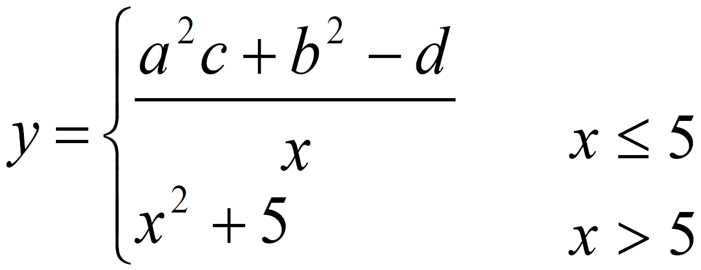
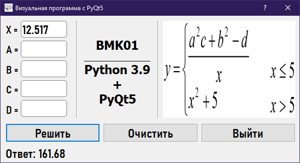
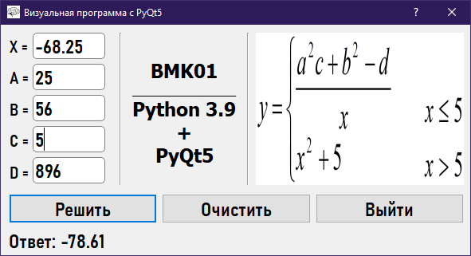
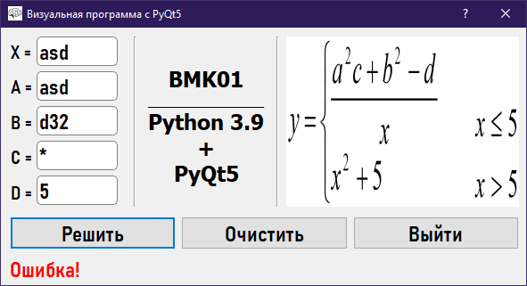

# BMK01_PyQt5
## Программирование на Python
## Современное кроссплатформенное программирование
### Практическая работа №2
### Вариант №1
Визуальная программа расчета математической величины по заданному в варианте алгоритму.
## Пример
  
## Решение 1
  
## Решение 2
  
## Ошибка
